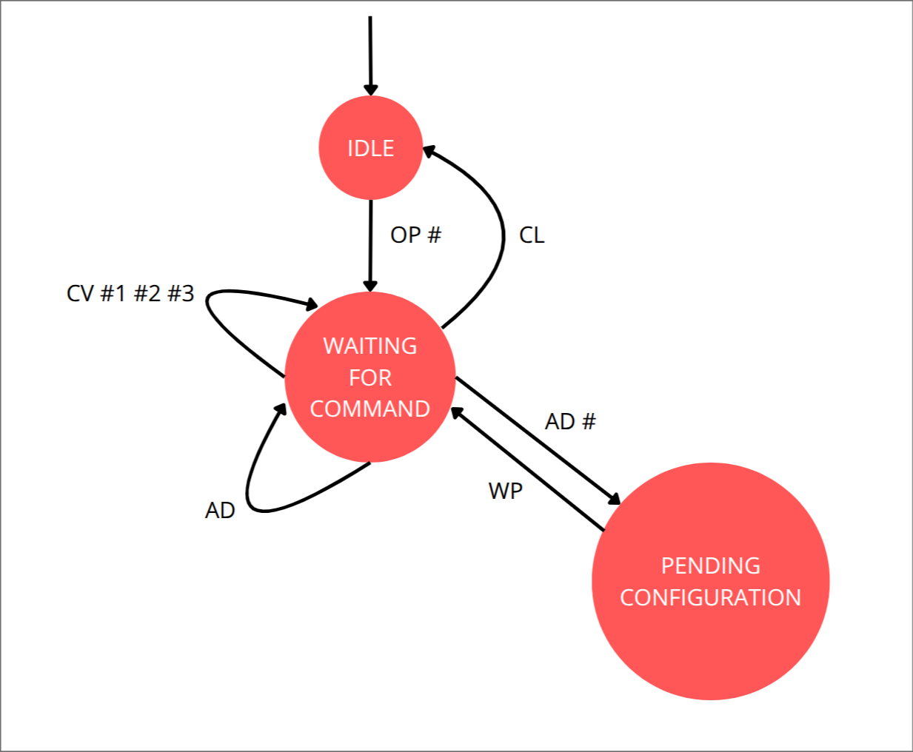

# Parallel Valve Controller RS485 - README

## Overview
This repository contains the hardware and software needed to build a 20 container controller under freertos SMP multicore architecture on UART ISR event driven processes for ESP32-S3.
The controller is responsible for listening to RS485 messages and actuate the connected containers accordingly.

## Features
- **Parallel Control**: Uses two XTensa LX7 Cores under freertos on container independent tasks.
- **Reduces PLC overhead**: PID control is performed under the ESP32-S3 and not the main PLC logic.
- **Communication**: Interfaces with the main controller via RS485 communication.

## Communication Protocol
The car module receives and sends commands via a predefined protocol:
- `OP #` - Opens the controller based on its id number #.
- `CL` - Immediately closes the RS485 communication with the controller.
- `AD` - Returns the current id of the controller.
- `AD #` - Assigns the number # as the controller id.
- `WP` - Makes the AD # command to take effect and needs a reboot.
- `CV #1 #2 #3` - Performs a control update on the specified #1 container, #2 with the current weight and #3 the weight setpoint

## Hardware

## Software Architecture

## FSM

## Troubleshooting
| Issue                          | Possible Cause                           | Solution |
|--------------------------------|------------------------------------------|----------|
| Valve not moving               | Loose wiring, wrong valve firmware       | Check connections, update your valve firmware |
| Solenoid not actuating         | Loose wiring                             | Check connections |
| Motor not mixing               | Loose wiring                             | Check connections |
| Container weight not available | Loose wiring, wrong digitalizer firmware | Check connections, update your valve firmware 
| No response                    | Communication failure, wrong firmware    | Verify RS485 wiring and settings, update the controller firmware |

## Contributors
- **Paolo Reyes** - Lead Developer

## License
This project is licensed under the MIT License - see the LICENSE file for details.
